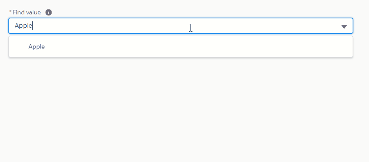

# Searchable PickList
##### @Author Hitesh Khatri

It is a reusable component which can be utilised search with the given character on client side server.

# Properties!

| Parameter | Description |
| ------ | ------ |
| options | Required parameter to provide option to the listbox |
| value | Assign value to the input field |
| size | Size of dropdown options to be shown |
| fieldLevelHelp | Text message for the tooltip |
| required | Attribute to make the field required |

Known Limitation:
  - Currently available on Aura Component
  - Filter according to start with character

Other Components :- 

 - BaseApp - Containse the BaseComponent to preview
 - BaseComponent - Containse the basic implementations of SearchablePickList component.
 
### References

Below are the refrences being utilised for 

* [Lightning Design System](https://www.lightningdesignsystem.com/components/combobox/#site-main-content) - AutomComplete comboBox style

